# 📖 LiterAlura - Interactive Book Management System


Welcome to **BookCatalog**! This is a backend application developed in Java 25 with Spring Boot that serves as an interactive book catalog via console. The system consumes the public **Gutendex** API (Project Gutenberg), processes the data, and persists it in a relational database (PostgreSQL) for future queries.

## 🏗️ Architecture and Data Flow

### 1. System Overview
The diagram below shows how components interact within the Docker environment.

```mermaid
graph TD
    User((User))
    subgraph "Docker Environment"
        App["Application Container<br/>(Spring Boot)"]
        DB[("PostgreSQL Container")]
    end
    API[☁️ Gutendex API]

    User -- "Interacts via Console" --> App
    App -- "Searches Books (HTTP)" --> API
    API -- "Returns JSON" --> App
    App -- "Persists/Queries Data" --> DB
```
 


### 2. Intelligent Search Flow (Algorithm)
We implemented a layered logic to ensure the correct book is found, using Regex with word boundaries to avoid incorrect partial matches.

```mermaid
flowchart TD
    Start([Search Start]) --> Input[/User enters Title/]
    Input --> Request[Request to Gutendex API]
    Request --> Response{Found results?}
    
    Response -- No --> NotFound([Returns: Book not found])
    Response -- Yes --> Filter1{Exact Match?}
    
    Filter1 -- Yes --> Found([✅ Book Found])
    Filter1 -- No --> Filter2{Contains Full Phrase?}
    
    Filter2 -- Yes --> Found
    Filter2 -- No --> Filter3{"Keyword Match<br/>(Regex with boundaries)"}
    
    Filter3 -- Yes --> Found
    Filter3 -- No --> NotFound
    
    Found --> CheckDB{Author exists in DB?}
    CheckDB -- Yes --> LinkAuthor[Associates Existing Author]
    CheckDB -- No --> SaveAuthor[Saves New Author]
    
    LinkAuthor --> SaveBook[Saves Book to DB]
    SaveAuthor --> SaveBook
    SaveBook --> Show[Displays Details in Console]
```



---

## 🚀 Features

1.  **🔍 Search book by title:** Connects to the API and uses the intelligent search algorithm.
2.  **📚 List registered books:** Displays all books saved locally.
3.  **✍️ List registered authors:** Shows authors and their books.
4.  **📅 List authors alive in a specific year:** Historical author filter.
5.  **🌐 List books in a specific language:** Filter by language code (EN, PT, etc.).

---

## 🛠️ Technologies Used

*   **Java 25 LTS:** Latest and most performant version of the language.
*   **Spring Boot 3.4.13:** Updated framework for productivity.
*   **Spring Data JPA:** Robust data persistence.
*   **PostgreSQL 16:** Modern relational database.
*   **Docker & Docker Compose:** Complete environment containerization.
*   **JUnit 5 & Mockito:** High-fidelity automated test suite.

---

## 🧪 Robust Automated Tests

The project uses a professional test suite to ensure reliability:

*   **Repository Tests (`DataJpaTest`):** Validates complex queries and database integrity (PostgreSQL 16).
*   **Service Unit Tests (`Mockito`):** Validates the search algorithm and filters in isolation and quickly.

To run the tests:
```bash
./scripts/test.sh
```

---

## 🐳 How to Run the Project

1.  **Complete Rebuild (First time or code changes):**
    ```bash
    ./scripts/rebuild.sh
    ```
2.  **Simple Startup (Just to run):**
    ```bash
    ./scripts/start.sh
    ```

Both scripts start the application in interactive mode directly in your terminal.

---

## 👨‍💻 Author

**Caio**

This project was developed as part of a learning journey in Java and Spring Boot, focusing on building robust backend applications with modern best practices.

---

## 📝 Notes

- The application uses the Gutendex API which provides access to Project Gutenberg's public domain books
- All user interactions happen through the console interface
- The database schema is automatically created on first run
- The intelligent search algorithm ensures accurate book matching even with partial titles
